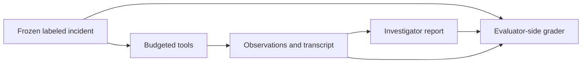

# InquestBench

**A working incident workbench and evaluation toolkit for microservice root-cause investigation.**

[Try the workbench](https://inquestbench.vercel.app) · [Tool API](docs/TOOLS.md) · [Grading](docs/GRADING.md) · [Frozen data](datasets/README.md) · [Related work](docs/RELATED_WORK.md) · [Roadmap](docs/ROADMAP.md)

Investigate an incident across eight services: follow dependencies, inspect metrics and logs, compare recent changes, and submit a diagnosis. The browser demo works without an API key. The Python toolkit exposes the same incident data through budgeted tools and grades reports against evaluator-held labels.

**Status:** incident construction, the browser workbench, frozen loading, budgeted tools, and report grading work today. Autonomous agents, a fitted reasoner, and end-to-end model experiments are not yet published. This is an early evaluation toolkit, not a validated production benchmark.

## What you can run

| Component | Delivered behavior | Evidence |
|---|---|---|
| Browser workbench | Select a frozen or generated case; inspect telemetry; submit a diagnosis and reveal the answer | [App](app.py), [web tests](tests/test_web.py) |
| Incident generator | Eight fault categories, one root cause, 120 minutes of telemetry, JSON serialization | [Generator](src/inquest/scenario.py), [example](examples/generate_incident.py) |
| Frozen inputs | 120 saved cases in nine sets, provenance manifest and SHA-256 verification | [Data guide](datasets/README.md), [loader tests](tests/test_frozen.py) |
| Investigation environment | Eight read-only tools, charged attempts, observation IDs and detached transcripts | [Tool contract](docs/TOOLS.md), [environment tests](tests/test_env.py) |
| Report grader | Service, fault and fix checks; malformed-report handling; citation validation; Brier loss | [Grading contract](docs/GRADING.md), [grader tests](tests/test_grader.py) |

The investigation example uses five predetermined queries. The grading example uses two handcrafted reports. Neither is an autonomous-agent result or an accuracy claim.

## Quick start

Use Python 3.14 for the locally verified setup:

```bash
git clone https://github.com/Pranjal677504/Inquest.git
cd Inquest
python3.14 -m venv .venv
source .venv/bin/activate
python -m pip install -e ".[dev]"
python app.py
```

Open `http://127.0.0.1:8000`. On Windows, use `py -3.14 -m venv .venv` and `.venv\Scripts\Activate.ps1`; Windows execution has not been verified.

For the Python examples and tests:

```bash
python examples/generate_incident.py
python examples/load_frozen_set.py
python examples/inspect_incident.py
python examples/grade_report.py
python -m pytest -q
```

**Dependencies:** the generator, loader, tools, and grader use the Python standard library. Installing the distribution also installs **Flask**, which runs the bundled web application. Tests use pytest. The current features require no model, provider key, or database. Future hosted-model experiments would need credentials; local-model experiments would need a model server and suitable compute.

**Python support:** package metadata targets Python 3.10+. Locally, installation, all four examples, and 243 tests have passed on Python 3.14. [CI](https://github.com/Pranjal677504/Inquest/actions/workflows/tests.yml) runs those checks on Python 3.10–3.14 on Linux; consult the workflow results for verified revisions. A configured matrix alone is not evidence of a pass. The hosted demo selects Python 3.14 in [`.python-version`](.python-version).

## A budgeted investigation

```python
from pathlib import Path
from inquest.env import InvestigationEnv
from inquest.frozen import load_frozen_set

# Evaluator-side setup: retain the labeled scenario outside the agent interface.
scenario = load_frozen_set(Path("datasets/smoke-v1"), "test-easy")[7]
env = InvestigationEnv(scenario, max_steps=5)

alerts = env.call("get_alerts")
print(alerts.id, alerts.text)
print("Steps remaining:", env.steps_left)
```

Available tools: `list_services`, `get_alerts`, `query_metric`, `search_logs`, `get_events`, `get_event`, `health_check`, and `get_trace`. Every attempted call consumes a step, including invalid requests. See [arguments, limits, and observation behavior](docs/TOOLS.md).

Reports name a service, fault type, fix action and target, observation IDs, and confidence. The [grader](docs/GRADING.md) separates diagnosis correctness from report validity. It rejects malformed confidence and invalid references rather than silently repairing them. Evidence relevance currently checks tool/service matches; it does **not** establish that the cited text supports a claim.



The browser is an unrestricted educational interface with answer reveal. Scored agents must use the budgeted observation interface, not the browser's case-selection metadata or diagnosis endpoint. Construction labels, seeds, scenario IDs, and gold metadata are excluded from tool observations. This boundary is not a sandbox against hostile Python code or memorization of public fixtures.

## Data and interpretation limits

[`inquest-smoke-v1`](datasets/README.md) contains 120 synthetic cases across `dev`, `test`, and `ood`, at three difficulties. Use `load_frozen_set` to verify and load the committed bytes. Do not regenerate comparison inputs from seeds: cross-version RNG equivalence is not guaranteed. Published suites are immutable; additions require a new version.

- The graph, eight fault categories, and handcrafted signatures are fixed. Recognizing those signatures can be easier than conducting an investigation.
- The `ood` split changes signal-log wording, not topology or failure mechanisms. It is not evidence of production generalization.
- The small public smoke suite is for interface checks, not sufficient likelihood training or strong performance claims.
- Gold tool/service relevance and fix action/target matches are coarse measures. Confidence scoring is implemented; calibration has not been demonstrated.
- No independent authored holdouts, fitted likelihood artifacts, or real-model result table are published yet.

## Research direction and related work

Replayability is established practice in incident benchmarks. [Cloud-OpsBench, OpenRCA, AIOpsLab, ITBench, ORCA-bench, and OpenRCA 2.0](docs/RELATED_WORK.md) provide relevant prior work with stronger operational or causal coverage. Their results are not directly comparable with this small synthetic suite.

Inquest's proposed experiments ask whether **information-gain probe selection**, **confidence calibration**, and **success under equal investigation budgets** improve over simpler policies. Those are questions to test, not demonstrated advantages or claims of novelty. The [design notes](docs/DESIGN.md) explain the proposed belief model and its assumptions.

Next priorities are independently authored cases and an actual local-model pilot with saved transcripts, failures, and usage. These precede convenience CLI work; the full structured-agent comparison still depends on implementing and validating the reasoner. [Acceptance criteria and prerequisites](docs/ROADMAP.md) define what must exist before results can be claimed.

## Repository guide

| Path | Contents |
|---|---|
| [`src/inquest/`](src/inquest) | Generator, topology, frozen loader, tools, and grader |
| [`app.py`](app.py), [`public/`](public) | Flask API and browser assets |
| [`examples/`](examples) | Four runnable API demonstrations |
| [`tests/`](tests), [CI workflow](.github/workflows/tests.yml) | Behavior checks, data integrity, and Python compatibility |
| [`datasets/`](datasets) | Versioned frozen cases and provenance |
| [`docs/`](docs) | Contracts, design rationale, related work, roadmap, and dated verification |

## Development and ownership

This repository integrates and improves an existing local Inquest prototype. The [development log](docs/DEVELOPMENT_LOG.md) records actual changes and verification dates; the [design notes](docs/DESIGN.md) distinguish implemented decisions from proposed ones.

**Maintainer: Pranjal Prajapati.** The maintainer sets priorities, accepts design changes, reviews evidence, and decides releases. Contributions should include a focused reproduction, a reason for the change, and appropriate validation. Use [issues](https://github.com/Pranjal677504/Inquest/issues) to discuss independently authored cases, bugs, or evaluation improvements.

## License

[MIT](LICENSE).
