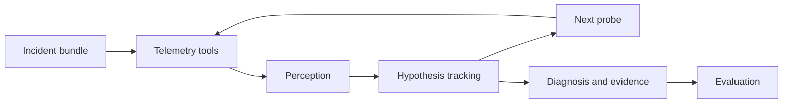

# InquestBench

**A reproducible test bed for agents that investigate microservice incidents.**

An alert identifies a symptom. An investigation has to identify the cause. InquestBench explores that gap with simulated incidents, read-only telemetry tools, and agents that must report a diagnosis with supporting evidence.

The project studies whether separating telemetry interpretation from explicit hypothesis tracking improves investigation accuracy and efficiency.

## Development status

This repository is being developed incrementally from an existing local Inquest prototype. The first milestone establishes the repository, scope, and verification plan. Runnable components, experiments, and results will be integrated in subsequent milestones after validation.

See the [roadmap](docs/ROADMAP.md) for acceptance criteria and the [development log](docs/DEVELOPMENT_LOG.md) for completed work. The log distinguishes prototype integration from new implementation and records verification alongside each change.

## Planned investigation loop

The initial scope is a deterministic synthetic system with eight services and eight fault types. Planned comparison points include a downstream-alert heuristic, random probing, Bayesian information-gain probing, and free-form and structured LLM agents.

## Research scope

The benchmark is synthetic. A rule-based perception agent is an oracle reference; its performance alone cannot establish LLM performance or real-world incident-response ability. Published results will include the exact scenario set, run settings, raw scores, failures, and limitations.

## License

[MIT](LICENSE).
