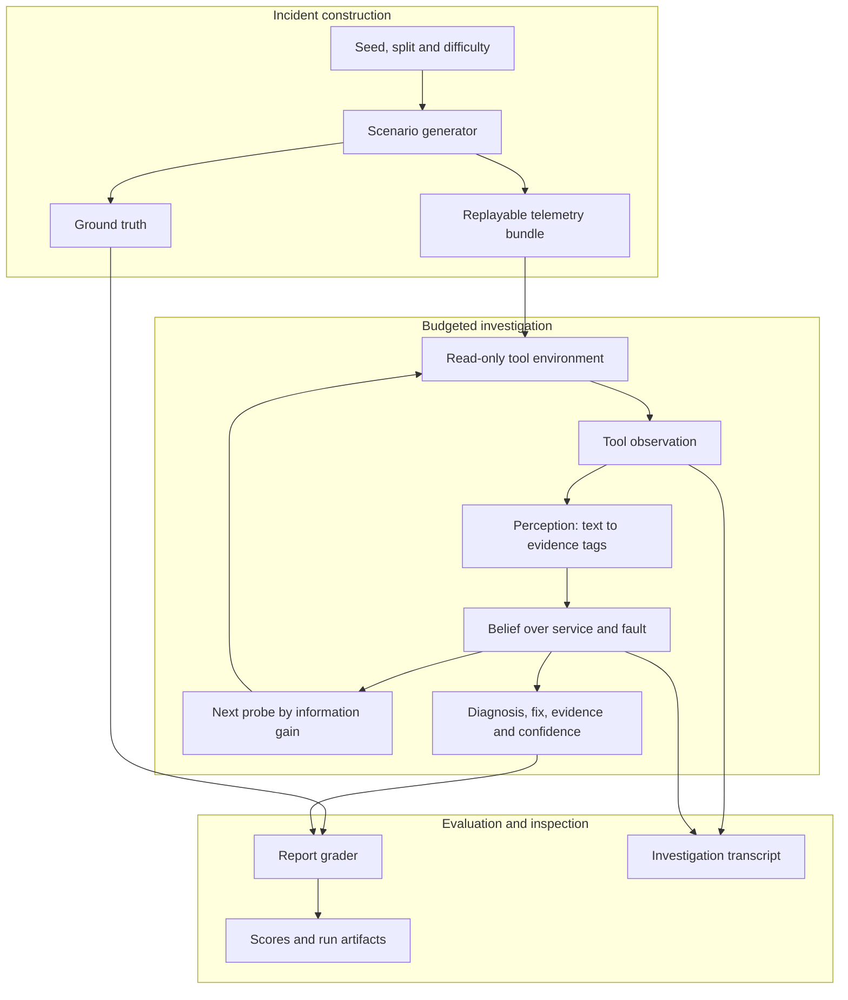
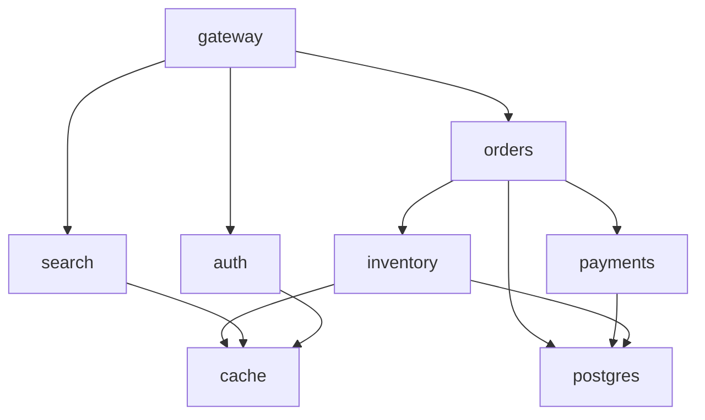

# InquestBench

**Replayable incident investigation for tool-using AI agents.**

InquestBench is a research and engineering project for evaluating how agents investigate failures in microservice systems. Its central question is whether separating **telemetry interpretation**, **hypothesis tracking**, and **probe selection** produces more accurate and efficient investigations.

An agent receives an incident and a limited investigation budget. It queries telemetry, distinguishes a root cause from its downstream symptoms, and submits a diagnosis with a proposed fix, supporting observations, and confidence.

[Architecture](#architecture) · [Benchmark design](#benchmark-design) · [Frozen sets](datasets/README.md) · [Agents](#agent-comparisons) · [Evaluation](#evaluation-protocol) · [Roadmap](docs/ROADMAP.md) · [Development log](docs/DEVELOPMENT_LOG.md)

> **Development preview:** The service topology, incident generator, and checksum-verified frozen incident loading are implemented, with runnable examples and tests. Nine frozen sets containing 120 cases are published in [`datasets/`](datasets/README.md). Investigation tools, grading, agents, and evaluation are being integrated incrementally from an existing local Inquest prototype. Those sections below describe the intended implementation; no end-to-end agent results are published yet.

## Why incident investigation?

Production incidents produce many correlated symptoms. An unavailable database can cause errors in payments, orders, and the gateway; the most visible alert may appear several services away from the initiating fault.

A useful investigation agent has to answer more than “which service is unhealthy?”

- Which service initiated the failure?
- What distinguishes a deployment regression from a configuration change or capacity problem?
- Which observation would most efficiently separate the remaining explanations?
- Does the cited evidence support the diagnosis?
- Is the agent's confidence consistent with how often it is correct?

For example, a database migration might introduce lock contention. Orders slow down, payment requests time out, and gateway errors increase. An investigator should connect these symptoms to the migration and database locks, then propose the relevant recovery action.

InquestBench makes this process replayable so investigation policies can be compared on the same incident.

## Project objectives

| Objective | Evidence the project will provide |
|---|---|
| Reproducible incidents | Serialized bundles, deterministic generation, and replay checks |
| Transparent reasoning | Explicit hypotheses, belief transitions, and selected probes |
| Fair agent comparisons | Identical cases, documented system knowledge, and equal investigation budgets |
| Auditable results | Raw episode scores, run manifests, transcripts, and recorded failures |
| Clear research boundaries | A benchmark card, calibration analysis, and documented validity limits |
| Practical developer experience | An installable command, tested examples, CI, and a verified release |

These are acceptance targets. Their completion is tracked in the [roadmap](docs/ROADMAP.md).

## Architecture

The design separates incident construction from investigation and grading.



**Scenario construction** produces telemetry and labeled outcomes. The intended evaluation boundary keeps ground truth out of agent observations; reviewing tool output for answer leakage is an explicit integration requirement.

**Perception** converts an observation into a small evidence vocabulary, such as an expired certificate, a recent configuration change, or an increase in database lock waits. A rule tagger provides an oracle reference; an LLM tagger supplies a learned interpretation.

**Reasoning** maintains competing service/fault hypotheses and updates them as observations arrive. The prototype uses a Naive Bayes likelihood model fitted on development scenarios.

**Probe selection** chooses the unused query with the highest expected information gain. The agent stops when it reaches its configured confidence threshold, further probes offer little expected information, or the budget is exhausted.

**Grading** compares the final report with the incident's labeled outcome and records accuracy, evidence quality, confidence, and investigation cost.

### Hypothesis-driven investigation

A hypothesis is a pair:

```text
(root-cause service, fault type)
```

The initial prototype contains 31 feasible pairs across its eight services and eight fault categories. For an observation, the likelihood model accounts for whether the inspected service is the hypothesized root, a caller, a callee, or unrelated.

Belief updates follow:

```math
P(h \mid e) \propto P(e \mid h)P(h)
```

Probe selection aims to maximize:

```math
\mathrm{EIG}(q)
= \mathcal{H}(H)
- \mathbb{E}_{o \sim P(o \mid q)}
  [\mathcal{H}(H \mid o,q)]
```

Here, `H` is the current distribution over hypotheses, `q` is a candidate probe, and `o` is a possible observation. The prototype enumerates binary tag outcomes to compute this quantity under its likelihood model.

The calculation depends on modeling assumptions. Correlated evidence can make Naive Bayes overconfident, so calibration and held-out evaluation are part of the research plan.

## Benchmark design

### Initial service topology

Arrows indicate calls from a service to its dependency. Failures can propagate back to callers.



The initial system includes `gateway`, `auth`, `orders`, `payments`, `inventory`, `search`, `cache`, and `postgres`. Configurable graphs and held-out topology evaluation are later milestones.

### Incident categories

Each incident has one labeled root service and fault type. The prototype builds 120 minutes of metrics, logs, change events, health information, and sampled traces.

| Fault | Characteristic investigation signals | Initial fix action |
|---|---|---|
| Bad deploy | Recent release, exceptions, increased errors | Roll back deployment |
| Configuration regression | Configuration change, pool exhaustion or rate limiting | Revert configuration |
| Resource leak | Memory growth, restarts, out-of-memory signals | Roll back deployment |
| Dependency outage | Unreachable dependency, failed health, caller timeouts | Fail over dependency |
| Certificate expiry | TLS failures, expired certificate health | Renew certificate |
| Traffic surge | Request growth, capacity pressure, load shedding | Scale up |
| Feature-flag flip | Recent flag change, slow gated handlers | Disable flag |
| Bad database migration | Migration event, lock contention, blocked queries | Roll back migration |

These signatures are synthetic and deliberately controlled. Fixes initially specify an action and target service; configuration keys, rollback versions, and other operational parameters require richer grading.

### Difficulty and data splits

Difficulty changes the quality and ambiguity of available evidence:

- **Easy:** dense fault signals with limited distractors.
- **Medium:** more decoy changes, benign anomalies, and some missing or misleading evidence.
- **Hard:** sparse logs, unrecorded changes, unrelated fault-like symptoms, and frequent misleading peer attribution.

| Split | Intended role | What changes |
|---|---|---|
| `dev` | Likelihood fitting, tuning, and training | Development seeds |
| `test` | Held-out evaluation within the generator | Separate seed offset |
| `ood` | Log-wording robustness | Separate seeds and alternate signal-log templates |

The existing `ood` design retains the same topology and incident mechanisms. Its rule tagger was written with both wording families visible. Rule-tagger performance on this split cannot establish language generalization.

### Frozen evaluation inputs

[`inquest-smoke-v1`](datasets/README.md) publishes 120 serialized incidents across development, test, and alternate-wording splits at all three difficulties. Each development set has eight cases; each test/alternate-wording set has sixteen. Fault categories are balanced within each set.

The JSONL files are accompanied by a provenance manifest and SHA-256 checksums. Load these committed bytes for comparisons instead of regenerating cases from seeds. The loader rejects mismatched checksums before parsing and checks case count, identity, order, and set settings. This establishes stable evaluation inputs without depending on cross-version RNG behavior.

This suite supplies small initial comparison fixtures. It is not sufficient for strong performance claims or reliable likelihood fitting, and it contains no agent results. Labels and construction metadata must remain on the evaluator side. See the [data guide](datasets/README.md) for verification commands, interpretation limits, and version policy.

### Investigation tools

The prototype exposes eight read-only tools. Calls consume a step, including invalid calls. Observation limits keep investigations budgeted.

| Tool | Information available |
|---|---|
| `list_services` | Service inventory and call dependencies |
| `get_alerts` | Firing alerts, onset times, and current values |
| `query_metric` | Metric summaries, baseline/recent comparisons, and deviations |
| `search_logs` | Recent log lines filtered by service, severity, and pattern |
| `get_events` | Deployment, configuration, flag, and migration events |
| `get_event` | Details of a selected change event |
| `health_check` | Service health, version, restarts, and certificate lifetime |
| `get_trace` | A sampled trace matching a requested status |

A stronger result should explain what the agent learned from these observations, not only report that it selected the correct answer.

## Agent comparisons

The integration plan includes both offline and LLM agents.

| Agent | Investigation policy | Purpose |
|---|---|---|
| Random probe | Random unused queries with the same belief updater | Measure the benefit of informed probe choice |
| Deepest alert | Inspect the most downstream alerting service | Simple operational heuristic |
| Bayesian reference | Rule perception, belief updates, information-gain probes | Oracle-perception reference |
| Noisy Bayesian reference | Simulated missed and spurious tags | Study sensitivity to perception errors |
| Noise-aware Bayesian reference | Likelihoods fitted under the same simulated noise | Study robustness to perception mismatch |
| ReAct | LLM selects tools and submits the report | Free-form agent comparison |
| Structured LLM | LLM extracts tags; explicit reasoner selects probes | Test the perception/reasoning decomposition |

Shared incident cases, budgets, and documented system knowledge are required for useful comparisons. A rule-perception result is a reference point for the reasoning system; real-model runs are needed to evaluate the end-to-end LLM agents.

## Evaluation protocol

### Report contract

The following is an **illustrative report**, not a measured experiment result:

```json
{
  "service": "postgres",
  "fault_type": "bad_migration",
  "fix": {
    "action": "rollback_migration",
    "target": "postgres"
  },
  "evidence": ["o3", "o7"],
  "confidence": 0.84,
  "summary": "Lock contention followed the migration and propagated to callers."
}
```

Evidence refers to observation IDs in the investigation transcript. The grader should treat malformed or unsupported reports explicitly rather than silently interpreting them as reliable answers.

### Measures

| Measure | What it evaluates | Interpretation limit |
|---|---|---|
| Service accuracy | Correct initiating service | Initial incidents contain one root cause |
| Fault accuracy | Correct fault category | Categories are fixed in the initial design |
| Fix accuracy | Correct action and target | Initial grading omits operational parameters |
| Joint success | Service, fault, and fix all match | Offline agents derive the fix from their service/fault prediction |
| Evidence precision | Relevance of cited observations | Prototype grading uses tool/service relevance; line-level support is planned |
| Brier score | Confidence versus actual joint success | Calibration needs held-out assessment |
| Investigation steps | Number of tool calls | Initial tools have uniform step cost |
| Token usage and runtime | Resource use | Observation-token estimates and actual LLM usage must be distinguished |

Success proportions will include confidence intervals. Failed runs, invalid outputs, and agent exceptions will be retained in the evaluation record.

### Reproduction requirements

Each published experiment should provide:

1. The code revision and exact command or configuration.
2. The scenario split, difficulty, seed range, and frozen incident set.
3. Agent settings, step budget, and prompt version.
4. The likelihood-model checksum and, for LLM runs, the model identity and backend.
5. Raw episode scores, errors, transcripts, and resource usage.
6. Generated summaries and plots with a reproduction command.
7. Representative failures and the limits of the conclusion.

The [roadmap](docs/ROADMAP.md) tracks implementation of these artifacts. **This branch does not yet publish a validated result table.** Existing local prototype results will be integrated only with their provenance and interpretation limits.

## Getting started

**Verified environment: Python 3.14.** Installation, both examples, and all 135 tests have been checked locally on that version. Python 3.10+ is the compatibility target declared in package metadata; versions 3.10–3.13 have not yet been tested. A version matrix is planned in milestone 09.

Use Python 3.14 for the currently verified setup:

```bash
git clone https://github.com/Pranjal677504/Inquest.git
cd Inquest
python3.14 -m venv .venv
source .venv/bin/activate
python -m pip install -e ".[dev]"
python examples/generate_incident.py
python examples/load_frozen_set.py
python -m pytest -q
```

On Windows, create the environment with `py -3.14 -m venv .venv` and activate it with `.venv\Scripts\Activate.ps1` in PowerShell; Windows execution has not yet been verified. The example constructs `dev-easy-7`: a database migration incident with eight services, 120 minutes of telemetry, two events, and 60 sampled traces. It serializes and reloads the complete bundle, verifies equality, and prints a SHA-256 fingerprint.

You can also construct scenarios through Python:

```python
from inquest import Scenario, generate, iter_scenarios

incident = generate(seed=7, difficulty="easy", split="dev")
restored = Scenario.from_json(incident.to_json())
assert incident == restored

cases = list(iter_scenarios("test", n=8, difficulty="hard", start=0))
```

The generator uses only the Python standard library and needs **no API key**. Tests use pytest. NumPy will be introduced with the offline reasoner. Hosted LLM backends will require provider credentials; a local model server can provide an alternative when suitable compute is available.

**Construction bundles contain ground truth**, including the root service, fault, and expected fix. The example prints those labels for inspection; it does not perform an agent investigation. Agents will access telemetry through the budgeted tool interface in the next milestone.

Seeds must be non-negative integers; supported difficulties are `easy`, `medium`, and `hard`, and splits are `dev`, `test`, and `ood`. JSON loading checks required bundle fields, labeled outcomes, metric dimensions and finite values, log records, event records, and trace records. Generation uses its own random-number generator without changing global random state. Byte-for-byte seed reproducibility is tested within the same Python runtime; cross-version fingerprints are not guaranteed. Use the [checksummed frozen files](datasets/README.md) as the canonical inputs for published comparisons.

### Current repository layout

```text
Inquest/
├── README.md                  Project design and status
├── LICENSE                    MIT license
├── pyproject.toml             Package and test configuration
├── .gitignore                 Generated files and credentials excluded
├── .gitattributes             Text normalization
├── src/inquest/
│   ├── __init__.py             Public construction API
│   ├── topology.py             Service graph and shortest-hop queries
│   ├── scenario.py             Telemetry generation and JSON bundles
│   └── frozen.py               Checksum-verified frozen set loader
├── tests/
│   ├── test_topology.py        Graph behavior and invalid service checks
│   ├── test_scenario.py        Fault coverage, replay, propagation, and validation
│   └── test_frozen.py          Saved cases, corruption checks, and no-RNG loading
├── examples/
│   ├── generate_incident.py    Runnable construction and replay example
│   └── load_frozen_set.py      Verify and load published incident files
├── datasets/
│   ├── README.md              Data guide and version policy
│   └── smoke-v1/              Nine JSONL sets, manifest, and SHA256SUMS
└── docs/
    ├── DESIGN.md              Decisions, rationale, and trade-offs
    ├── ROADMAP.md             Milestones and acceptance criteria
    └── DEVELOPMENT_LOG.md     Completed work and verification
```

Planned additions include investigation tools, agents, a CLI, experiment artifacts, CI workflows, and a benchmark card. The layout will be updated as those components become available.

## Development roadmap

| Phase | Milestones | Deliverable |
|---|---|---|
| Foundation | 01–05 | Incident bundles, tools, grading, and safe replay commands |
| Investigation | 06–10 | Belief tracking, offline agents, reproducible evaluation, packaging, and transcript inspection |
| Research evidence | 11–16 | LLM integration, real-model pilot, failure analysis, calibration, authored incidents, and topology variation |
| Showcase and release | 17–18 | Reproducible figures, walkthrough, benchmark card, and verified release |

The repository foundation and first source-code integration were completed on **6 October 2026**. The checked milestones record that initial day's work; the remaining milestones describe future development. The [development log](docs/DEVELOPMENT_LOG.md) records actual changes, verification, and limitations. Dates reflect when work occurred.

### Project ownership and design decisions

**Maintainer: Pranjal Prajapati.** The maintainer sets project scope and priorities and is responsible for accepting design changes, reviewing evidence, and deciding when a release is ready. Contribution reviews should include the reason for a choice, its alternatives, and its limitations.

The [design notes](docs/DESIGN.md) explain the current implementation choices and distinguish them from planned agent architecture. They provide a basis for technical discussion and review as the project evolves.

## Known limitations

- **Generator coupling:** A reasoner fitted on the same handcrafted generator may exploit its patterns.
- **Oracle perception:** A rule tagger knows the authored signal vocabulary.
- **Restricted initial scope:** One topology, one root cause per incident, and eight fault categories simplify investigation.
- **Confidence assumptions:** Correlated tags violate the reasoner's independence assumption.
- **Coarse evidence and fixes:** Tool/service relevance and action/target matches do not establish complete operational support.
- **External validity:** Synthetic success requires independent incident validation before drawing conclusions about production use.

These limitations motivate the holdout incidents, calibration, evidence-support checks, and topology shifts in the roadmap.

## Contributing

Useful contributions include reproducible bug reports, independently authored incident cases, stronger comparison agents, and evaluation improvements.

Use [GitHub issues](https://github.com/Pranjal677504/Inquest/issues) to discuss a change and relate it to a roadmap milestone. Explain the behavior being changed, provide a focused reproduction or example, and include appropriate validation with a pull request. Report limitations alongside experimental improvements.

## License

InquestBench is available under the [MIT license](LICENSE).
